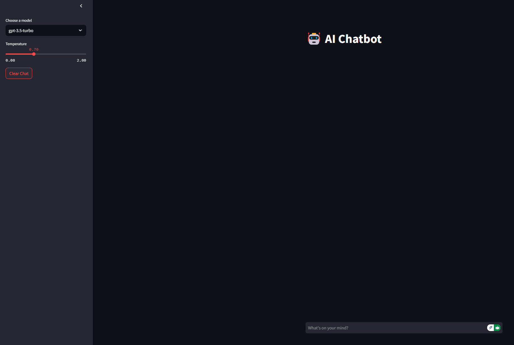

# AI Chatbot with Streamlit 🤖

A modern chatbot application built with Streamlit and OpenAI's GPT models, featuring a sleek dark theme UI and error monitoring with Sentry.

## 📸 Screenshot



## 🚀 Features

- 💬 Real-time chat interface
- 🎨 Modern dark theme UI
- 🔄 Multiple GPT model support (GPT-3.5-turbo, GPT-4)
- 🎛️ Adjustable temperature controls
- 📊 Error monitoring with Sentry
- 🔐 Secure API key handling

## 🛠️ Installation

1. Clone the repository:

``` bash
git clone https://github.com/yourusername/ai-chatbot.git
cd ai-chatbot
```

## 🐳 Docker Instructions

### Prerequisites
- Docker installed on your machine
- Docker Compose (optional, but recommended)
- OpenAI API key
- Sentry DSN (optional)

### 2. Building & Running

#### Using Docker Compose (Recommended)
```bash
# Build and run the container
docker-compose up --build

# Run in detached mode
docker-compose up -d

# Stop the container
docker-compose down
```

#### Using Docker directly
```bash
# Build the image
docker build -t chatbot .

# Run the container
docker run -it --rm --gpus all -p 8501:8501  -v $PWD:/app chatbot /bin/bash

# Stop the container
docker stop ai-chatbot

# Remove the container
docker rm ai-chatbot
```

### 3. Accessing the Application
- Main application: http://localhost:8501
- Health check: http://localhost:8501/_stcore/health


## ⚙️ Configuration

1. Create a `.streamlit/secrets.toml` file:
```toml
OPENAI_API_KEY = "your-openai-api-key"
SENTRY_DSN = "your-sentry-dsn"
```

2. Never commit your secrets file:
``` bash
echo ".streamlit/secrets.toml" >> .gitignore
```

## 🚀 Running the App

``` bash
streamlit run app.py
```

The app will be available at `http://localhost:8501`

## 🔧 Environment Variables

The following environment variables are required:

- `OPENAI_API_KEY`: Your OpenAI API key
- `SENTRY_DSN`: Your Sentry DSN for error monitoring

## 📁 Project Structure

```
ai-chatbot/
├── app.py              # Main application file
├── Dockerfile         # Docker configuration
├── docker-compose.yml # Docker compose configuration
├── requirements.txt   # Python dependencies
├── .env              # Environment variables
├── .gitignore        # Git ignore file
├── README.md         # Project documentation
├── styles/           # CSS styles directory
│   ├── __init__.py
│   └── main.css      # Main CSS styles
├── utils/            # Utility functions
│   ├── __init__.py
│   └── style_loader.py  # CSS loading utility
└── .streamlit/
    └── secrets.toml  # Configuration secrets
```
## 🎯 Usage

1. Select your preferred model from the sidebar
2. Adjust the temperature for response creativity
3. Type your message in the chat input
4. Clear the chat history using the sidebar button

## 🔍 Monitoring

This project uses Sentry for error tracking and performance monitoring. Key metrics tracked:

- Error rates
- Response times
- User interactions
- API call performance


## 📝 License

This project is licensed under the MIT License - see the LICENSE file for details.


Additional material for prototyping tour chatbot using cutting edge technologies: 
Using [Ollama](https://ollama.ai/) to downlaod models:

``` cmd
D:OllamaSetup.exe /DIR="D:\Ollama_models"
```

``` powershell
ollama pull llama3
```
Note : You can setup the model's location by editing your OS environment variable.

You can run LangFlow with the following command : 
```
langflow run --port 7860 --host 0.0.0.0
```

